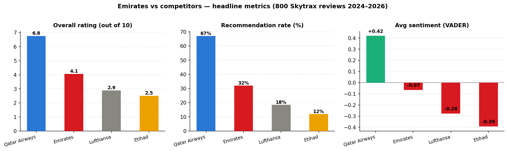
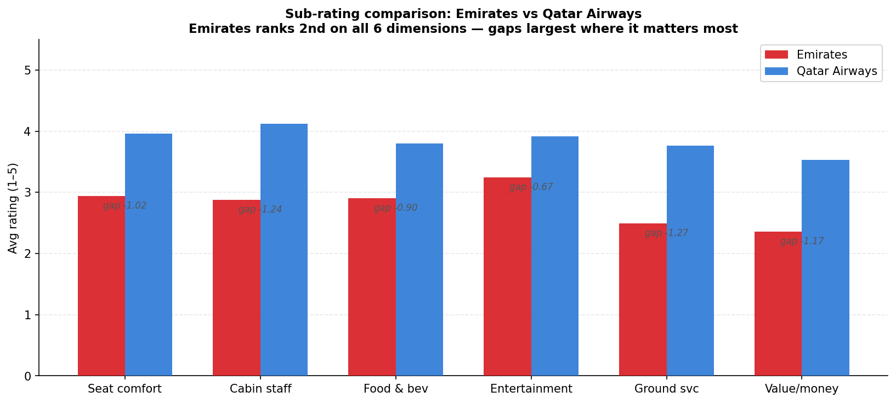
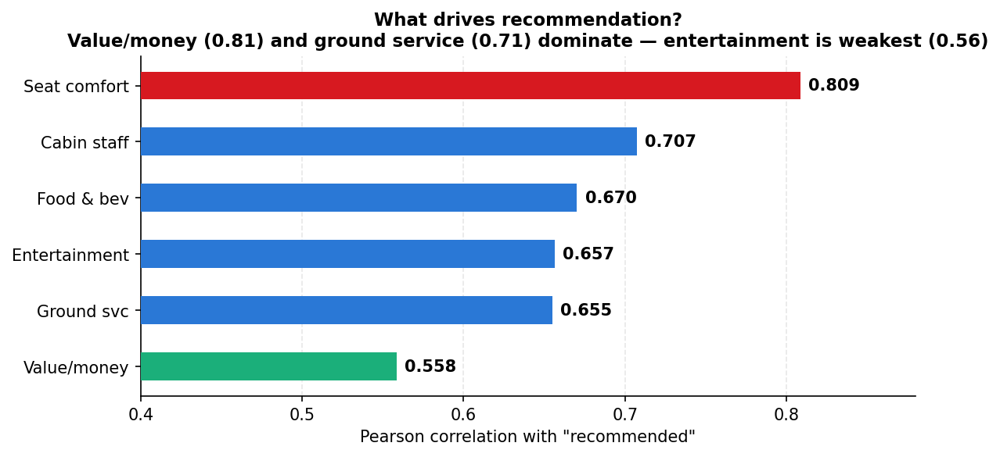
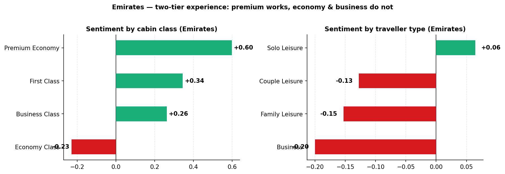
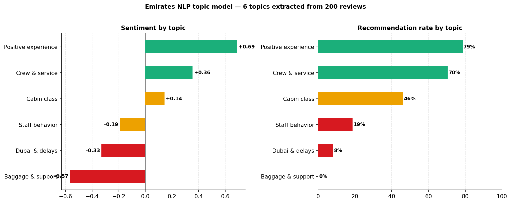
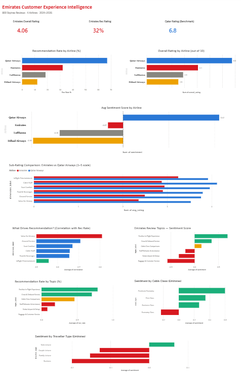

# Emirates Customer Experience Intelligence
### What 800 Skytrax reviews reveal about where Emirates is winning, losing, and what to fix first



---

## The one-paragraph summary

Emirates holds a 5-star Skytrax rating and markets itself as the world's premium airline — yet only **32% of recent reviewers recommend it**, versus **67% for Qatar Airways**. This project scrapes and analyzes 800 current Skytrax reviews across Emirates, Qatar Airways, Etihad, and Lufthansa, applies VADER sentiment analysis and NMF topic modeling, and surfaces four findings a CX or commercial team could act on tomorrow. The headline: Emirates' largest competitive gaps are in the two dimensions that most drive recommendation (value for money and ground service), while it markets heavily in the dimension that drives recommendation least (in-flight entertainment).

---

## Key findings

### 1 · Baggage & customer service failures → 0% recommendation rate
When something goes wrong — a lost bag, a Dubai connection issue, a customer service call — Emirates loses the passenger permanently. 35 reviews fell into this topic cluster. Zero recommendations. No other topic comes close.

### 2 · Emirates underperforms most where passengers care most





| Dimension | Emirates | Qatar | Gap | Correlation with rec |
|---|---|---|---|---|
| Value for money | 2.36 | 3.53 | **−1.17** | **0.81** (strongest) |
| Ground service | 2.49 | 3.76 | **−1.27** | **0.71** |
| Inflight entertainment | 3.25 | 3.92 | −0.67 | **0.56** (weakest) |

Emirates' two largest gaps vs Qatar are in the two dimensions that most predict recommendation. Its smallest gap is in the dimension that least predicts recommendation — yet this is what Emirates markets most aggressively.

### 3 · Two-tier experience problem



Premium Economy (+0.60) and First Class (+0.34) passengers are net positive. Economy class passengers are net negative (−0.23). Business travellers — highest lifetime value, most likely to rebook on corporate accounts — are also net negative (−0.20). The premium product works. The mass product doesn't.

### 4 · NLP topic model reveals where experience breaks down



| Topic | Sentiment | Rec rate |
|---|---|---|
| Positive in-flight experience | +0.69 | 79% |
| Crew & onboard service | +0.36 | 70% |
| Cabin class comparisons | +0.14 | 46% |
| Staff behavior & assistance | −0.19 | 19% |
| Dubai airport & delays | −0.33 | 8% |
| **Baggage & customer service** | **−0.57** | **0%** |

## Power BI Dashboard



Full interactive single-page dashboard built in Power BI Desktop covering all 8 findings.

📥 Download `emirates_cx_dashboard.pbix` to explore interactively.
---

## Project structure

```
emirates-cx-intelligence/
│
├── data/
│   ├── all_airlines_analyzed.csv      # 800 reviews, all 4 airlines, with sentiment + rec_binary
│   └── emirates_analyzed.csv          # Emirates only, with topic assignments
│
├── scripts/
│   ├── scrape_skytrax.py              # Scraper — pulls fresh reviews from airlinequality.com
│   └── scrape_consumeraffairs.py      # Supplementary scraper for ConsumerAffairs reviews
│
├── emirates_cx_intelligence.ipynb     # Full analysis notebook (start here)

├── emirates_cx_dashboard.pbix     # Power BI dashboard file
├── dashboard_screenshot.png       # Dashboard preview image

├── fig1_headline_metrics.png
├── fig2_subrating_gap.png
├── fig3_correlation.png
├── fig4_topics.png
├── fig5_cabin_breakdown.png
│
└── README.md
```

---

## How to run

```bash
# 1. Clone the repo
git clone https://github.com/YOUR_USERNAME/emirates-cx-intelligence.git
cd emirates-cx-intelligence

# 2. Install dependencies
pip install pandas numpy matplotlib scikit-learn vaderSentiment requests beautifulsoup4

# 3. Open the notebook
jupyter notebook emirates_cx_intelligence.ipynb
```

The notebook runs end-to-end on the included CSVs — no need to re-scrape. To pull fresh reviews, run `scripts/scrape_skytrax.py` from your own machine (not a sandboxed environment — Skytrax rate-limits cloud IPs).

---

## Data sources

| Source | Coverage | Reviews |
|---|---|---|
| Skytrax (airlinequality.com) | Emirates, Qatar, Etihad, Lufthansa | 800 (200 per airline) |
| Date range | 2024–2026 | Most recent available |

**Bias note:** Skytrax reviews skew toward aviation enthusiasts and frequent flyers. Dissatisfied passengers are more likely to write reviews than satisfied ones, so absolute sentiment figures should be read directionally rather than as population-representative scores.

---

## Tech stack

- **Data collection:** `requests`, `BeautifulSoup`
- **Analysis:** `pandas`, `numpy`
- **Sentiment:** VADER (`vaderSentiment`)
- **Topic modeling:** TF-IDF + NMF (`scikit-learn`)
- **Visualization:** `matplotlib`
- **Dashboard:** Power BI Desktop (DAX measures, custom color theme)

---

## Potential extensions

- Scale to 500+ reviews per airline for statistically robust sub-group analysis
- Add route-level filtering (e.g. Dubai–London vs Dubai–JFK)
- Fine-tune a transformer model (e.g. `cardiffnlp/twitter-roberta-base-sentiment`) for improved sentiment accuracy on mixed reviews
- Build a Streamlit dashboard for interactive filtering by route, cabin class, and time period
- Expand competitor set to include Singapore Airlines and Turkish Airlines

---

*If this was useful, please star the repo. Feedback and pull requests welcome.*

## Power BI Dashboard
Built in Power BI Desktop. Download the `.pbix` file to open locally.
**Screenshot preview:**

